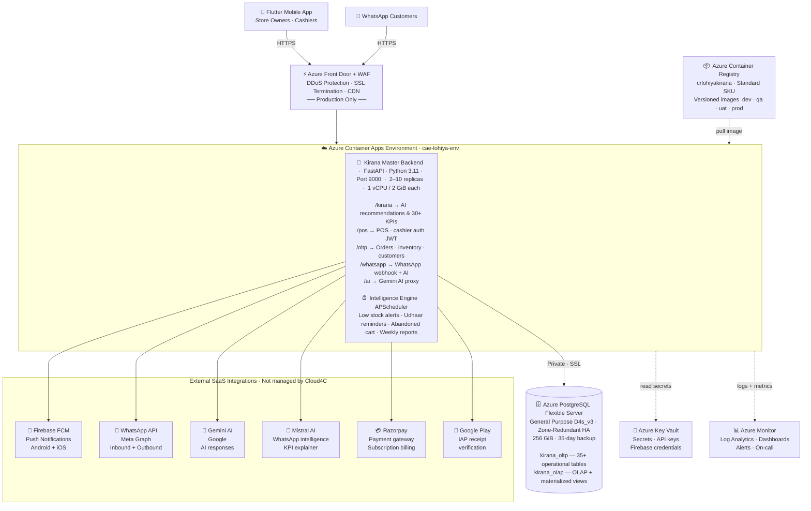

# Kirana AI — System Architecture Document

**Prepared for:** Cloud4C (Production Managed Services Quotation)  
**Prepared by:** Bhanuprakash - ML Engineer, Lohiya AI  
**Date:** 2026-05-30  
**Environment scope:** Production (Prod), with references to Dev/QA/UAT separation

---

## 1. System Overview

Kirana AI is a SaaS platform that provides AI-powered business intelligence, POS (point-of-sale), inventory management, and WhatsApp automation for kirana (grocery) stores across India.

The backend is a single unified FastAPI application (Python 3.11) that serves:
- Mobile app (Flutter) — store owners/cashiers
- WhatsApp Business API — automated customer interactions
- Admin panel — platform operators

---

## 2. Architecture Diagram

```
                            ┌───────────────────────────────────────────────────────────┐
                            │                         INTERNET                          │
                            └───────────────────────────┬───────────────────────────────┘
                                                        │ HTTPS
                            ┌───────────────────────────▼───────────────────────────────┐
                            │           Azure Front Door / WAF (Prod only)              │
                            │     DDoS protection, SSL termination, CDN caching         │
                            └───────────────────────────┬───────────────────────────────┘
                                                        │
                            ┌───────────────────────────▼───────────────────────────────┐
                            │              Azure Container Apps Environment             │
                            │                  (cae-lohiya-<env>)                       │
                            │                                                           │
                            │   ┌───────────────────────────────────────────────────┐   │
                            │   │           Kirana Master Backend (FastAPI)         │   │
                            │   │               kirana-backend:vN                   │   │
                            │   │           Port 9000 — uvicorn, 2–4 workers        │   │
                            │   │                                                   │   │
                            │   │  Modules:                                         │   │
                            │   │   /kirana  — AI recommendations, KPIs             │   │
                            │   │   /pos     — POS, cashier auth (JWT)              │   │
                            │   │   /oltp    — Orders, inventory, customers         │   │
                            │   │   /whatsapp— WhatsApp webhook + AI responses      │   │
                            │   │   /ai      — Gemini proxy endpoint                │   │
                            │   │   /kpis    — 30+ KPI calculators                  │   │
                            │   │                                                   │   │
                            │   │  Intelligence Engine (APScheduler — background)   │   │
                            │   │   Low stock alerts, udhaar reminders,             │   │
                            │   │   abandoned cart detection, weekly reports        │   │
                            │   └───────────────────────────────────────────────────┘   │
                            └───────────────────────────┬───────────────────────────────┘
                                                        │ Private / SSL
                            ┌───────────────────────────▼────────────────────────────────┐
                            │           Azure Database for PostgreSQL Flexible Server    │
                            │                  psql-lohiya-<env>                         │
                            │                  Database: db-kirana-<env>                 │
                            │                                                            │
                            │  Schemas:                                                  │
                            │   kirana_oltp — 35+ operational tables                     │
                            │                 (store, users, product, orders,            │
                            │                  inventory, customer, khata, supplier,     │
                            │                  subscription, intelligence_log ...)       │
                            │   kirana_olap — OLAP analytics tables + materialized views │
                            └────────────────────────────────────────────────────────────┘

                            ┌────────────────────────────────────┐
                            │     Azure Container Registry       │
                            │     crlohiyakirana (Standard)      │
                            │     Stores versioned Docker images │
                            └────────────────────────────────────┘

                            External Services (SaaS — not managed by Cloud4C):
                            ┌──────────────────┐  ┌──────────────────┐  ┌──────────────────┐
                            │  Firebase (FCM)  │  │  WhatsApp API    │  │   Gemini AI      │
                            │  Push notifs     │  │  (Meta Graph)    │  │   (Google)       │
                            │  Android + iOS   │  │  Inbound/outbound│  │   AI responses   │
                            └──────────────────┘  └──────────────────┘  └──────────────────┘
                            ┌──────────────────┐  ┌──────────────────┐  ┌──────────────────┐
                            │   Mistral AI     │  │    Razorpay      │  │  Google Play     │
                            │  WhatsApp intell.│  │  Payment gateway │  │  IAP receipt     │
                            │  + KPI explainer │  │  Subscription    │  │  verification    │
                            └──────────────────┘  └──────────────────┘  └──────────────────┘
```

---

### 2b. Architecture Diagram (Mermaid)

> Renders natively on **GitHub**, **GitLab**, **Notion**, and **VS Code** (with Markdown Preview Mermaid Support extension).  
> For a visual/editable version, open `architecture.drawio` in [diagrams.net](https://diagrams.net) (free).



---

## 3. Azure Services Required

### 3.1 Core Compute

| Service | Dev (current) | Production (recommended) |
|---|---|---|
| **Azure Container Apps** | 1 app, 0.5 vCPU / 1 GiB, min 0 replicas | 1 app, 1 vCPU / 2 GiB, min 2 replicas, max 10 |
| **Container App Environment** | Consumption plan | Dedicated workload profile (D4 or higher) |
| **Azure Container Registry** | Standard SKU | Standard SKU (same — add geo-replication for DR) |

> The backend is stateless — horizontal scaling works out of the box. The intelligence engine (APScheduler) runs in-process; for prod, consider moving it to a separate Container App or Azure Container Jobs to avoid duplicate scheduler instances across replicas.

### 3.2 Database

| Attribute | Dev (current) | Production (recommended) |
|---|---|---|
| Service | PostgreSQL Flexible Server | PostgreSQL Flexible Server |
| SKU | Burstable B1ms (1 vCore, 2 GiB) | General Purpose D4s_v3 (4 vCores, 16 GiB) |
| Storage | 32 GiB | 256 GiB, auto-grow enabled |
| High Availability | None | Zone-redundant HA (automatic failover) |
| Backup | 7-day retention | 35-day retention + geo-redundant backup |
| Read replica | None | 1 read replica (for OLAP / KPI queries) |
| SSL | Required | Required |
| Private networking | Public (firewall rules) | VNet integrated (private access only) |

### 3.3 Security & Secrets

| Service | Dev | Production |
|---|---|---|
| **Azure Key Vault** | Not used | All secrets (DB password, API keys, WhatsApp tokens, Firebase credentials) stored here; app reads at startup |
| **Managed Identity** | Not configured | System-assigned managed identity on Container App → access to Key Vault, ACR |
| **VNet / Private Endpoint** | Not used | Container App Environment in VNet; DB via private endpoint (no public DB access) |
| **Azure Firewall / NSG** | Not used | NSG on subnet; only Container App can reach DB |

### 3.4 Observability & Operations

| Service | Dev | Production |
|---|---|---|
| **Azure Monitor** | Not configured | Enabled — metrics for CPU, memory, replica count, request latency |
| **Log Analytics Workspace** | Not configured | All container logs shipped here; 90-day retention |
| **Application Insights** | Not configured | Optional — request tracing, dependency maps |
| **Azure Alerts** | None | Alerts on: error rate > 1%, CPU > 80%, DB connections > 80%, replica restarts |
| **Azure Backup** | Not configured | Automated daily DB backup via Flexible Server retention |

### 3.5 Networking & Delivery

| Service | Dev | Production |
|---|---|---|
| **Azure Front Door** | Not used | Global load balancer + WAF + DDoS protection + SSL offload |
| **Custom Domain / SSL** | Not configured | Custom domain (e.g., `api.kiranaai.in`) with managed TLS cert |
| **CDN** | Not used | Static assets (`/static/`) cached at edge via Front Door CDN |

---

## 4. Environment Topology

The team manages Dev, QA, and UAT. Cloud4C manages Production.

```
┌─────────────────┐   ┌─────────────────┐   ┌─────────────────┐   ┌──────────────────────┐
│      DEV        │   │       QA        │   │      UAT        │   │    PRODUCTION        │
│  (team manages) │   │  (team manages) │   │  (team manages) │   │  (Cloud4C manages)   │
│                 │   │                 │   │                 │   │                      │
│ ca-dev          │   │ ca-qa           │   │ ca-uat          │   │ ca-prod              │
│ psql-dev        │   │ psql-qa         │   │ psql-uat        │   │ psql-prod (HA)       │
│ B1ms DB         │   │ B1ms DB         │   │ D2s DB          │   │ D4s DB + read replica│
│ Consumption ACA │   │ Consumption ACA │   │ Consumption ACA │   │ Dedicated ACA        │
└─────────────────┘   └─────────────────┘   └─────────────────┘   └──────────────────────┘
         │                      │                     │                       │
         └──────────────────────┴─────────────────────┴───────────────────────┘
                                        │
                              Azure Container Registry
                            (single registry, all environments)
                            crlohiyakirana (Standard SKU)
                            Tags: :dev-* :qa-* :uat-* :prod-*
```

Each environment has its own:
- Container App + Environment
- PostgreSQL Flexible Server + Database
- All environment variables / secrets (separate Key Vault per env in prod)

They share:
- One Azure Container Registry (image repo)
- External SaaS integrations (with separate API keys per env where possible)

---

## 5. Application Components (What's Inside the Container)

| Component | Technology | Purpose |
|---|---|---|
| Web framework | FastAPI (Python 3.11) + Uvicorn | REST API server, 2–4 workers |
| ORM / DB driver | SQLAlchemy 2.0 + psycopg2 | PostgreSQL access |
| ML models | XGBoost, scikit-learn, pandas | Demand forecasting, reorder predictions |
| Auth | JWT (python-jose) + bcrypt | POS cashier login, store owner auth |
| Push notifications | firebase-admin SDK | FCM to Android/iOS Flutter app |
| WhatsApp AI | Mistral AI (`mistral-small-latest`) | WhatsApp conversation intelligence |
| AI proxy | Google Gemini API | On-demand AI responses via `/ai` endpoint |
| Scheduler | APScheduler 3.x | Background intelligence alerts (low stock, udhaar reminders, etc.) |
| Payments | Razorpay SDK | Subscription billing |

---

## 6. Data Flow

### 6.1 Mobile App → Backend
```
Flutter App → HTTPS → Azure Front Door (WAF) → Container App (FastAPI)
                                                        ↓
                                               PostgreSQL (kirana_oltp)
                                                        ↓
                                               Response to app
```

### 6.2 WhatsApp Message Flow
```
Customer WhatsApp → Meta servers → POST /whatsapp/webhook → Container App
                                                                   ↓
                                                          Mistral AI (intent)
                                                                   ↓
                                                          PostgreSQL (lookup order/inventory)
                                                                   ↓
                                                          WhatsApp API → Customer reply
```

### 6.3 Intelligence Engine (Background)
```
APScheduler (every 15–60 min) → DB query → Alert condition met?
                                                    ↓ yes
                                             Firebase FCM → Store owner phone
```

### 6.4 CI/CD (Deploy Pipeline)
```
Git push to master → Azure DevOps pipeline → Tests → docker build
                                                           ↓
                                                    Push to ACR
                                                           ↓
                                               az containerapp update → Rolling deploy
```

---

## 7. Storage & State

| What | Where | Notes |
|---|---|---|
| All business data | PostgreSQL `kirana_oltp` schema | 35+ tables |
| Analytics / OLAP | PostgreSQL `kirana_olap` schema | Partitioned by month |
| ML model artifacts | Baked into Docker image (`/app/ml_models/`) | Rebuilt on re-train, new image built |
| App logs | Container stdout → Log Analytics | No persistent volume needed |
| Firebase credentials | `serviceAccountKey.json` — currently baked into image | **Prod: move to Key Vault** |
| WhatsApp sessions | PostgreSQL `public.whatsapp_sessions` table | In-DB, no Redis needed |

> There is **no Redis, no blob storage, no message queue** currently. All state is in PostgreSQL. This keeps the architecture simple but means the DB is the single point of failure — mitigated by HA in production.

---

## 8. Production Readiness Gaps (for Cloud4C to note)

These are items not yet configured in the current dev setup that Cloud4C should handle for production:

| Gap | Current state | Recommended for prod |
|---|---|---|
| Secrets management | Secrets in env vars (plaintext) | Azure Key Vault + Managed Identity |
| DB private access | Public endpoint with firewall rules | VNet + Private Endpoint |
| HA / Failover | No HA on DB | Zone-redundant PostgreSQL HA |
| WAF / DDoS | None | Azure Front Door + WAF Policy |
| Monitoring | No alerts or dashboards | Azure Monitor + Log Analytics + Alerts |
| DB backups | 7-day default | 35-day + geo-redundant |
| Firebase credentials | JSON file in container | Key Vault secret |
| Intelligence engine scaling | Runs in every app replica (duplicate jobs risk) | Separate Container Job or leader-election |
| ML model storage | Baked into image | Azure Blob Storage mount (faster re-deploy) |
| Custom domain / SSL | Uses Azure default FQDN | Custom domain + managed cert |
| Read scaling (KPI queries) | All queries hit primary DB | Read replica for analytics/KPI endpoints |

---

## 9. Estimated Azure Resources for Production (for quotation)

Cloud4C should quote on managing / operating these resources in the Production environment:

| Resource | SKU / Config | Est. monthly cost (INR, rough) |
|---|---|---|
| Container Apps Environment | Dedicated, D4 workload profile | ₹15,000–20,000 |
| Container App (2–10 replicas) | 1 vCPU / 2 GiB per replica | ₹8,000–25,000 (load-dependent) |
| PostgreSQL Flexible Server | General Purpose D4s_v3, Zone-redundant HA | ₹25,000–30,000 |
| PostgreSQL Read Replica | General Purpose D2s_v3 | ₹12,000–15,000 |
| Azure Container Registry | Standard SKU | ₹1,500–2,000 |
| Azure Front Door + WAF | Standard tier | ₹8,000–12,000 |
| Azure Key Vault | Standard | ₹500–1,000 |
| Log Analytics Workspace | Pay-per-GB (est. 5–10 GB/month) | ₹2,000–4,000 |
| Azure Monitor Alerts | Basic | ₹500–1,000 |
| **Total estimate** | | **₹72,000–1,05,000/month** |

> These are rough estimates only. Actual cost depends on traffic volume, storage growth, and replica scaling. Cloud4C should use the Azure Pricing Calculator with actual expected RPS and data volumes.

---

## 10. External SaaS Dependencies (not on Azure — Cloud4C does not manage these)

| Service | Provider | Used for | Billed by |
|---|---|---|---|
| Firebase Cloud Messaging | Google Firebase | Push notifications to Flutter app | Lohiya AI (free tier likely sufficient) |
| WhatsApp Business API | Meta (Graph API) | Inbound/outbound WhatsApp messages | Lohiya AI (per-message billing) |
| Gemini AI | Google | AI chat responses via `/ai` endpoint | Lohiya AI (per-token billing) |
| Mistral AI | Mistral | WhatsApp intelligence + KPI explanations | Lohiya AI (per-token billing) |
| Razorpay | Razorpay | Subscription payment processing | Lohiya AI (% per transaction) |
| Google Play | Google | In-app purchase receipt verification | No additional cost |

---

## 11. Handover Scope Summary for Cloud4C

**Cloud4C manages (Production environment only):**
- Azure Container Apps (deployment, scaling, health monitoring)
- Azure Database for PostgreSQL (HA, backups, performance tuning, patching)
- Azure Container Registry (image lifecycle, retention policies)
- Azure Front Door + WAF (routing, SSL, DDoS)
- Azure Key Vault (secret rotation, access policies)
- Log Analytics + Azure Monitor (dashboards, alerts, on-call response)
- VNet / NSG (network security)
- Firewall rules and access control

**Lohiya AI team manages (Dev, QA, UAT + code):**
- Application code and Docker image builds
- Database schema changes (via versioned migration scripts)
- CI/CD pipeline (Azure DevOps)
- All external SaaS integrations and API keys
- Feature development and releases
